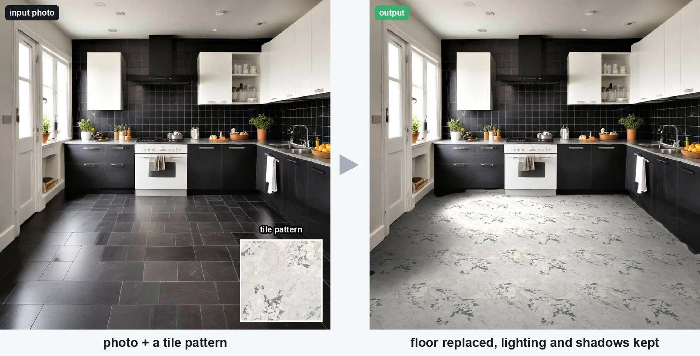
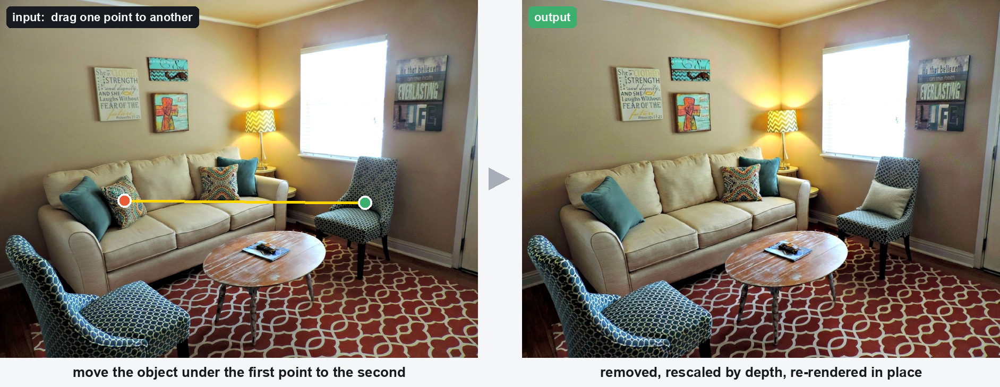
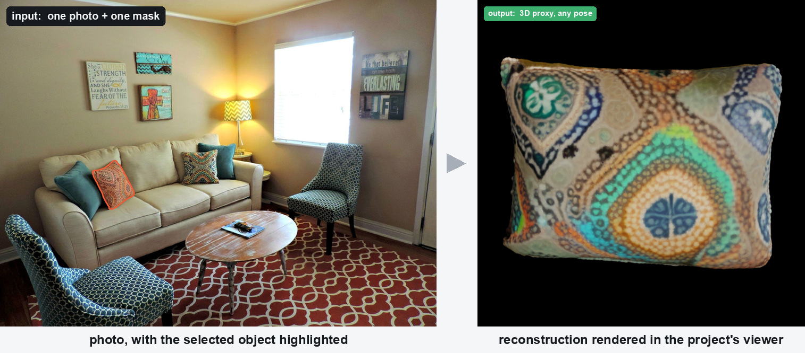
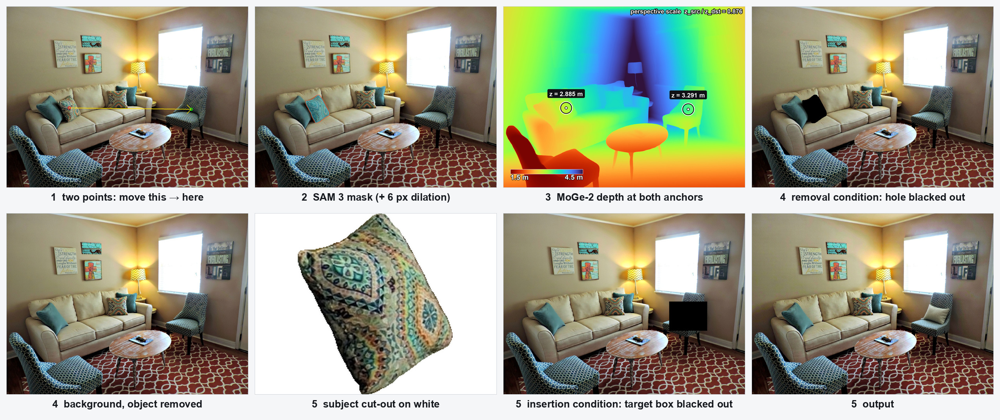
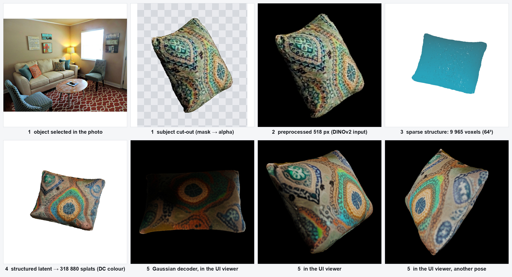
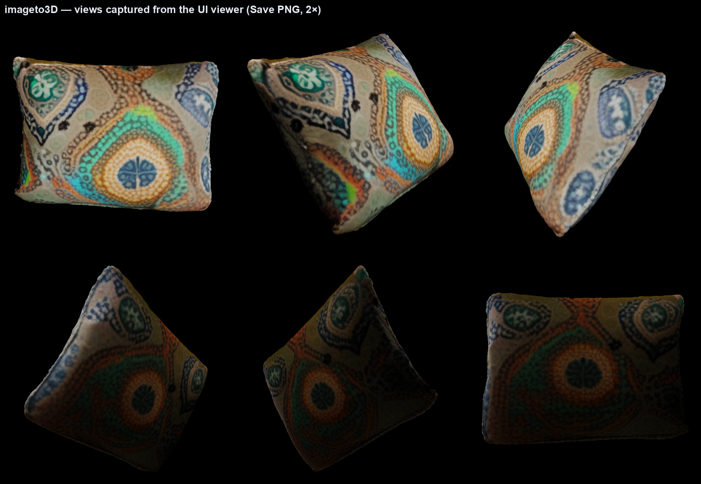

# imageEditor

Two local, non-generative-first editing pipelines for room photos, built for a 16 GB Intel Arc iGPU (PyTorch XPU; runs
unchanged on CUDA or CPU):

| pipeline | what it does | script | time on the iGPU |
|---|---|---|---|
| **floor_edit** | replace the floor with a tiled texture in true perspective and scale, keeping the photo's shadows and lighting | `floor_edit/floor_edit.py` | ~20 s |
| **object_edit** | move the object under a click point to another point, with perspective rescale and background fill | `object_edit/object_edit.py` | ~1.7 min |
| **imageto3D** | reconstruct a 3D proxy (Gaussian splats + textured mesh) of one selected object, and render it from any pose | `imageto3D/image_to_3d.py` | ~1.7 min |

Nothing outside the edited region is touched, and no object names or captions are given to any model.







## Quickstart

```bash
# 1. PyTorch for your accelerator (pick one), then the rest
pip install torch torchvision --index-url https://download.pytorch.org/whl/xpu     # Intel XPU
pip install torch torchvision --index-url https://download.pytorch.org/whl/cu128   # CUDA
pip install -r requirements.txt

# 2. code dependencies (repos/) + model weights (weights/, ~13 GB from Hugging Face)
python setup.py                    # or --pipeline floor | object, --check to see what is present

# 3. run
python floor_edit/floor_edit.py --scene input/scene.jpeg --pattern input/pattern.png
python object_edit/object_edit.py --coords input/object_move.json
python -m imageto3D.image_to_3d --image data/jobs/<job>/obj0_subject_512.png
```

Outputs land in `outputs/floor_edit/<scene>/<pattern>/<seg>/output.jpg` and `outputs/object_edit/<scene>/output.jpg`,
each with the intermediate masks / maps and a `metrics.json` (per-stage time, peak accelerator memory).

`setup.py` is a bootstrap script, not a setuptools file: it clones `MoGe`, `rgbx`, `FreeFine`, `lama` at pinned
commits and downloads the weights below with `huggingface_hub`. It skips anything already present, so it can be re-run
after an interrupted download. `facebook/sam3` is gated, so the `jetjodh/sam3` mirror is used; set `HF_TOKEN` if a
repo asks for it.

| weights folder | source | used by | size |
|---|---|---|---|
| `segformer-b5-ade` | `nvidia/segformer-b5-finetuned-ade-640-640` | floor | 0.3 GB |
| `upernet-convnext-l` | `openmmlab/upernet-convnext-large` | floor | 0.9 GB |
| `sam3` | `jetjodh/sam3` (mirror of `facebook/sam3`) | both | 3.4 GB |
| `moge-2-vitl-normal` | `Ruicheng/moge-2-vitl-normal` | both | 1.3 GB |
| `rgb-to-x` | `zheng95z/rgb-to-x` | floor | 4.9 GB |
| `stable-diffusion-v1-5` | `stable-diffusion-v1-5/stable-diffusion-v1-5` (fp16) | object | 2.0 GB |
| `big-lama` | `smartywu/big-lama` | object | 0.4 GB |
| `dpir` | `deepinv/drunet` `drunet_deepinv_color_finetune_22k.pth` (DRUNet) | pre-clean + DDRM super-resolution | 0.13 GB |
| `trellis-image-large` | `microsoft/TRELLIS-image-large` (+ DINOv2 ViT-L via `torch.hub`) | imageto3D (not fetched by setup.py) | 3.3 GB |
| `flux1-dev-gguf`, `flux-vae`, `omnipaint` | `second-state/FLUX.1-dev-GGUF` (Q8_0), `nerualdreming/flux_vae`, `yeates/OmniPaint` | object (`omnipaint` backends only; not fetched by setup.py) | 12.7 GB + 0.3 GB + 66 MB |

## floor_edit

```
photo ──► 1. floor mask ─────────────────────────────────┐
      ├─► 2. MoGe-2 point map + intrinsics ─► plane fit ─┤
      └─► 3. illumination map ───────────────────────────┤
                                                         ▼
pattern ─────────────────────► 4. tile on the plane × shading, composite ──► output.jpg
```

1. **Segmentation** — mean-softmax ensemble of SegFormer-B5 + UPerNet ConvNeXt-L (ADE20K classes floor + rug), or SAM 3
   with the text prompt "floor" (`--seg sam3`). Optional test-time augmentation with majority vote (`--tta N`).
2. **Geometry** — MoGe-2 ViT-L metric point map and camera intrinsics; a least-squares plane is fitted to the floor points.
3. **Illumination** — RGB→X "diffuse irradiance" (linear-RGB in, gamma-decoded out) or a luminance heuristic (`--illum`).
   Thin structures (old grout lines, specks) are filtered out so only real shadows and light fall-off remain.
4. **Render** — each pixel's ray is intersected with the plane to get metric floor coordinates, the pattern is tiled at
   `--tile-m` metres per repeat, multiplied by the shading map and composited through a soft floor mask.

Details, options, timings and limits: [floor_edit/README.md](floor_edit/README.md).

## object_edit

Input is a JSON with the scene and one or more `{"initial": {x, y}, "final": {x, y}}` pairs (see `input/object_move*.json`);
per move, `src_box`/`dst_box` may replace the points (their centres are used) and `mask` (PNG path) skips SAM.

The pipeline is four blocks; the last two are swappable modules picked by name:

| block | module | default | alternatives |
|---|---|---|---|
| 1. object mask | `object_edit/segment.py` | SAM 3 tracker, one click at `initial`, best of 3 proposals, cleaned, dilated 6 px | mask supplied by the UI / JSON |
| 2. perspective scale | `object_edit/geometry.py` | MoGe-2 depth ratio `z(initial) / z(final)` | `--scale <number>` |
| 3. object removal | `object_edit/removal/` | `lama`: big-lama + feature refinement, native res | `lama-plain` (~5 s), `freefine` (SD-1.5 bg-gen), `omnipaint` (FLUX.1-dev + removal LoRA, one 512 window per hole, ~9 min each) |
| 4. object insertion | `object_edit/insertion/` | `freefine`: affine paste into a 512 window, FreeFine regeneration, feathered composite | `paste` (affine paste only, no model), `omnipaint` (FLUX.1-dev + insertion LoRA: subject cut-out + rectangular target, generative re-render, ~12 min per object; `--omnipaint-mode full` runs the whole frame at 1024 instead of a per-object window) |



`--src-region` / `--dst-region` (`mask | dilated | box | full`, margin `--region-margin`) choose how far around the object each
stage may repaint: `mask` is a pure cut-paste (old shadows stay), `dilated`/`box` open a band so a generative backend can
remove the cast shadow at the source and render one at the target, `full` keeps everything the model renders.
`--sr-factor 2|3|4` sets the **processing resolution** (UI: "Processing resolution"): the frame is block-averaged by the
factor, removal / insertion run on the small frame, and the result is super-resolved with **DDRM** ([deepinv](https://github.com/deepinv/deepinv)
`sampling.DDRM` + DRUNet, block-average SVD operator, `--sr-steps` DDIM timesteps, default 15). Only the pixels the edit
changed are taken from the super-resolved image; the rest stays native. Scene uploads in the UI are also **pre-cleaned**
once with DDRM (identity operator, noise 0.005, 5 DDIM steps; `--preclean` on the CLIs) and every stage runs on that image.
`--removal` / `--insertion` select the backend. A new backend is one file implementing `Remover.remove(image, hole)` or
`Inserter.insert(original, background, move)` (contracts in `removal/base.py`, `insertion/base.py`) plus one registry line.

Known limits: one click selects one SAM object (attached items and cast shadows are not carried along); no shadow synthesis.

## imageto3D

Reconstruct a 3D proxy of a single object from one photo, and render it from any pose. This is the first half of
[DIRECT](https://github.com/Gong1130/DIRECT) (ICML 2026), whose full pipeline poses a reconstructed proxy and uses the
render as geometric guidance for a FLUX inpainter. Here the reconstruction half is driven **as an API** — the vendored
`trellis.pipelines.TrellisImageTo3DPipeline` at `repos/DIRECT/third_party/trellis`, called in the same sequence as
DIRECT's `demo/demo.py` and `preprocess/preprocess_example.py`.

```
photo + object mask ──► 1. subject cut-out (alpha) ──► 2. DINOv2 conditioning
                                                            │
        3. sparse-structure flow (16³ latent → 64³ occupancy → ~10 k voxels)
                                                            │
        4. structured-latent flow ──► slat ──┬─► Gaussian decoder ──► gaussian.ply
                                             └─► FlexiCubes decoder ──► mesh.glb
```



```bash
python -m imageto3D.image_to_3d --image data/jobs/<job>/obj0_subject_512.png
python -m imageto3D.image_to_3d --image photo.jpg --mask mask.png --save-slat
python -m imageto3D.render3d --mesh outputs/image_to_3d/<stem>/mesh.glb --orbit 8
python -m imageto3D.render3d --mesh ... --yaw 40 --pitch 20 --kind normal --crop
```

Outputs land in `outputs/image_to_3d/<stem>/`: `gaussian.ply` (3DGS), `mesh.glb` + `mesh.ply` (vertex-coloured),
`gaussian_points.ply` (splats decoded to a plain coloured point cloud for ordinary viewers), `preview.png` (4-view
turntable), `input_processed.png`, optional `slat.pt`, and `metrics.json`. About 100 s and 10.7 GB peak on the iGPU for
a 512 px crop (~10 k voxels, ~338 k mesh vertices).



Options: `--formats gaussian mesh radiance_field`, `--matte {auto,white,rmbg,none}`, `--mask`, `--seed`,
`--ss-steps` / `--slat-steps` / `--cfg`, `--save-slat`, `--fp32`, `--no-preview`, `--no-viewer-ply`.
Matting picks the object's alpha: `auto` uses an existing alpha channel, else a white backdrop, else RMBG-2.0 — which is
a gated repo, so subject crops on white should use `--matte white` and anything else `--mask`.

## Web UI

```bash
pip install -r requirements.txt                       # adds fastapi, uvicorn, python-multipart
cd web && npm install && npm run build && cd ..       # once (Node 22)
python -m uvicorn server.app:app --port 8000          # http://localhost:8000
```
For development: `npm run dev` in `web/` serves the UI on :5173 and proxies `/api` and `/files` to :8000.

- **Floor edit**: upload the photo and the tile pattern, Generate.
- **Object move**: upload the photo; drag a box around an object → three SAM 3 masks appear (the image is encoded once on
  upload, each box is decoded against the cached embedding in tens of ms) → pick one or paint your own → drag a box
  where it should go (its centre is the destination) → add more objects or Generate.
- **Image to 3D**: upload the photo; drag a box around an object → pick one of the SAM 3 masks (no brush step) →
  the reconstruction runs as a job → the result appears in a three.js viewer. Drag to orbit the camera; the X/Y/Z
  sliders rotate the object itself, which is what DIRECT's viser gizmo does before it renders a posed view.
  Toggle between the Gaussian splat (default) and the mesh, and download either.
- Runs are jobs on a single GPU worker thread (`server/gpu.py`); the UI polls `/api/jobs/<id>` and shows per-stage
  timings and the intermediates. Files live under `data/` (git-ignored).

## Layout

```
floor_edit/floor_edit.py    whole floor pipeline (docstring documents stages and flags)
object_edit/object_edit.py  object-move orchestrator + CLI; segment.py, geometry.py, removal/, insertion/ are the four blocks
object_edit/resolution.py   working-resolution stage: block-average downsampling and DDRM super-resolution (deepinv)
object_edit/preclean.py     DDRM identity pre-clean run on every uploaded scene
imageto3D/image_to_3d.py    image -> 3D proxy via DIRECT's TRELLIS pipeline (CLI + `image_to_3d()`)
imageto3D/trellis_compat.py pure-PyTorch stand-ins for spconv / xformers / kaolin, so TRELLIS runs without CUDA
imageto3D/render3d.py       pose-controlled mesh rendering (DIRECT's camera math, PyTorch rasteriser)
server/                     FastAPI API + GPU worker + interactive SAM session
web/                        Vite + React UI (src/BoxCanvas.tsx does boxes, mask overlay and brush painting;
                            src/SplatViewer.tsx and src/MeshViewer.tsx are the 3D panels)
input/                      test scenes, marble pattern, object-move JSONs
ablations/                  CSVs from the model survey and stage ablations that led to these choices
setup.py, requirements.txt  environment bootstrap
repos/, weights/, outputs/  created by setup.py / the scripts; git-ignored
```

## Notes

- Tested on Windows 11, Python 3.13, PyTorch 2.13 XPU (Intel Arc 140T, 16 GB shared memory). The device is chosen
  automatically (cuda > xpu > cpu). On XPU, MoGe-2 runs in fp32 (fp16 autocast is broken there).
- iGPU memory is carved from system RAM: run GPU jobs sequentially and never keep two large models resident. The first
  model call in a process pays 5-15 s of kernel warm-up.
- The choice of every model comes from the experiments in `ablations/`: a 10-model survey of generative editors
  (MatSwap, ControlTile, LBM, FLUX Kontext, Qwen-Image-Edit, …) was dropped in favour of the geometric render because
  it is 5-70× faster, keeps the pattern faithful and changes nothing outside the mask.
